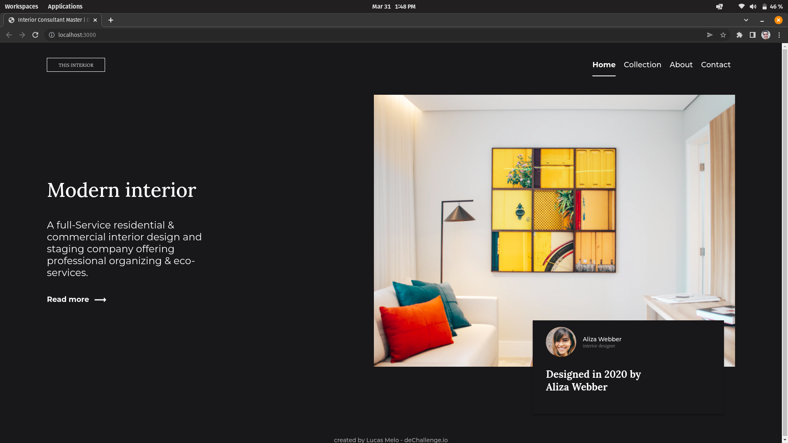

<h1 align="center">Interior Consultant Master - devChallenge</h1>

   Solution for a challenge from  <a href="http://devchallenges.io" target="_blank">Devchallenges.io</a>.

  <h3>
    <a href="https://lucasmelosilva.github.io/interior-consultant-master/">
      Demo
    </a>
     | 
    <a href="https://github.com/lucasmelosilva/interior-consultant-master">
      Solution
    </a>
     | 
    <a href="https://devchallenges.io/challenges/Jymh2b2FyebRTUljkNcb">
      Challenge
    </a>
  </h3>

<!-- TABLE OF CONTENTS -->

## Table of Contents

- [Overview](#overview)
  - [Built With](#built-with)
- [Contact](#contact)

<!-- OVERVIEW -->

## Overview

A demostração da página pode ser encontrada [aqui](https://lucasmelosilva.github.io/interior-consultant-master/)

### Built With

<!-- This section should list any major frameworks that you built your project using. Here are a few examples.-->

- html
- css 
- javascript
## Contact

- E-mail: lucas.melo044@gmail.com
- whatsapp: 81 989030704